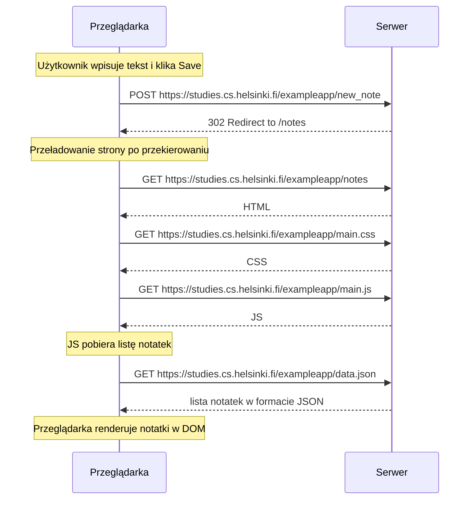

```mermaid
sequenceDiagram
    participant B as Przeglądarka
    participant S as Serwer

    Note over B: Użytkownik wpisuje tekst i klika Save

    B->>S: POST https://studies.cs.helsinki.fi/exampleapp/new_note
    S-->>B: 302 Redirect to /notes

    Note over B: Przeładowanie strony po przekierowaniu
    B->>S: GET https://studies.cs.helsinki.fi/exampleapp/notes
    S-->>B: HTML

    B->>S: GET https://studies.cs.helsinki.fi/exampleapp/main.css
    S-->>B: CSS

    B->>S: GET https://studies.cs.helsinki.fi/exampleapp/main.js
    S-->>B: JS

    Note over B: JS pobiera listę notatek
    B->>S: GET https://studies.cs.helsinki.fi/exampleapp/data.json
    S-->>B: lista notatek w formacie JSON

    Note over B: Przeglądarka renderuje notatki w DOM
```
