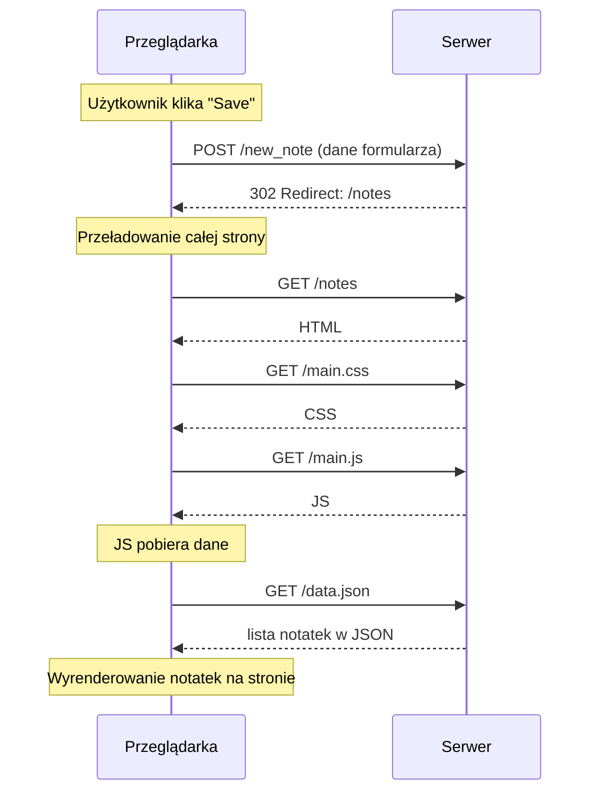

```mermaid
sequenceDiagram
    participant B as Przeglądarka
    participant S as Serwer

    Note over B: Użytkownik klika "Save"
    B->>S: POST /new_note (dane formularza)
    S-->>B: 302 Redirect: /notes

    Note over B: Przeładowanie całej strony
    B->>S: GET /notes
    S-->>B: HTML

    B->>S: GET /main.css
    S-->>B: CSS

    B->>S: GET /main.js
    S-->>B: JS

    Note over B: JS pobiera dane
    B->>S: GET /data.json
    S-->>B: lista notatek w JSON

    Note over B: Wyrenderowanie notatek na stronie
```
