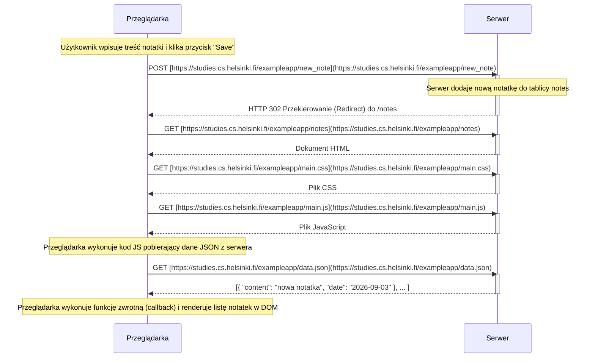

```mermaid
sequenceDiagram
    participant browser as Przeglądarka
    participant server as Serwer

    Note over browser: Użytkownik wpisuje treść notatki i klika przycisk "Save"

    browser->>server: POST [https://studies.cs.helsinki.fi/exampleapp/new_note](https://studies.cs.helsinki.fi/exampleapp/new_note)
    activate server
    Note over server: Serwer dodaje nową notatkę do tablicy notes
    server-->>browser: HTTP 302 Przekierowanie (Redirect) do /notes
    deactivate server

    browser->>server: GET [https://studies.cs.helsinki.fi/exampleapp/notes](https://studies.cs.helsinki.fi/exampleapp/notes)
    activate server
    server-->>browser: Dokument HTML
    deactivate server

    browser->>server: GET [https://studies.cs.helsinki.fi/exampleapp/main.css](https://studies.cs.helsinki.fi/exampleapp/main.css)
    activate server
    server-->>browser: Plik CSS
    deactivate server

    browser->>server: GET [https://studies.cs.helsinki.fi/exampleapp/main.js](https://studies.cs.helsinki.fi/exampleapp/main.js)
    activate server
    server-->>browser: Plik JavaScript
    deactivate server

    Note over browser: Przeglądarka wykonuje kod JS pobierający dane JSON z serwera

    browser->>server: GET [https://studies.cs.helsinki.fi/exampleapp/data.json](https://studies.cs.helsinki.fi/exampleapp/data.json)
    activate server
    server-->>browser: [{ "content": "nowa notatka", "date": "2026-09-03" }, ... ]
    deactivate server

    Note over browser: Przeglądarka wykonuje funkcję zwrotną (callback) i renderuje listę notatek w DOM
```
