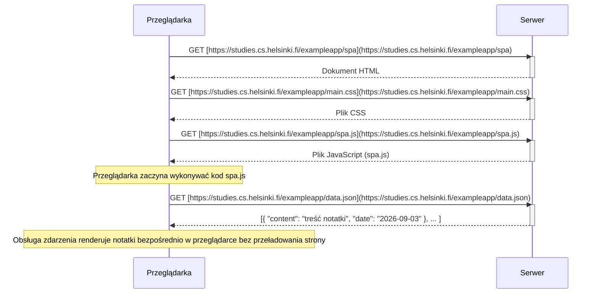

```mermaid
sequenceDiagram
    participant browser as Przeglądarka
    participant server as Serwer

    browser->>server: GET [https://studies.cs.helsinki.fi/exampleapp/spa](https://studies.cs.helsinki.fi/exampleapp/spa)
    activate server
    server-->>browser: Dokument HTML
    deactivate server

    browser->>server: GET [https://studies.cs.helsinki.fi/exampleapp/main.css](https://studies.cs.helsinki.fi/exampleapp/main.css)
    activate server
    server-->>browser: Plik CSS
    deactivate server

    browser->>server: GET [https://studies.cs.helsinki.fi/exampleapp/spa.js](https://studies.cs.helsinki.fi/exampleapp/spa.js)
    activate server
    server-->>browser: Plik JavaScript (spa.js)
    deactivate server

    Note over browser: Przeglądarka zaczyna wykonywać kod spa.js

    browser->>server: GET [https://studies.cs.helsinki.fi/exampleapp/data.json](https://studies.cs.helsinki.fi/exampleapp/data.json)
    activate server
    server-->>browser: [{ "content": "treść notatki", "date": "2026-09-03" }, ... ]
    deactivate server

    Note over browser: Obsługa zdarzenia renderuje notatki bezpośrednio w przeglądarce bez przeładowania strony
```
