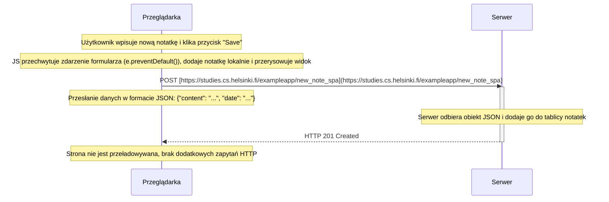

```mermaid
sequenceDiagram
    participant browser as Przeglądarka
    participant server as Serwer

    Note over browser: Użytkownik wpisuje nową notatkę i klika przycisk "Save"
    Note over browser: JS przechwytuje zdarzenie formularza (e.preventDefault()), dodaje notatkę lokalnie i przerysowuje widok

    browser->>server: POST [https://studies.cs.helsinki.fi/exampleapp/new_note_spa](https://studies.cs.helsinki.fi/exampleapp/new_note_spa)
    activate server
    Note over browser: Przesłanie danych w formacie JSON: {"content": "...", "date": "..."}
    Note over server: Serwer odbiera obiekt JSON i dodaje go do tablicy notatek
    server-->>browser: HTTP 201 Created
    deactivate server

    Note over browser: Strona nie jest przeładowywana, brak dodatkowych zapytań HTTP
```
