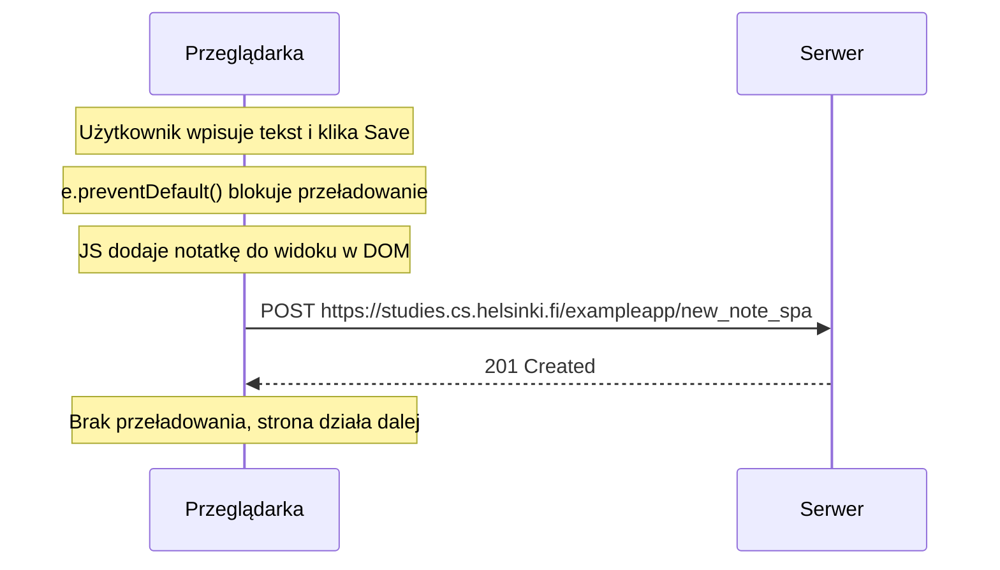

```mermaid
sequenceDiagram
    participant B as Przeglądarka
    participant S as Serwer

    Note over B: Użytkownik wpisuje tekst i klika Save
    Note over B: e.preventDefault() blokuje przeładowanie
    Note over B: JS dodaje notatkę do widoku w DOM

    B->>S: POST https://studies.cs.helsinki.fi/exampleapp/new_note_spa
    S-->>B: 201 Created

    Note over B: Brak przeładowania, strona działa dalej
```
